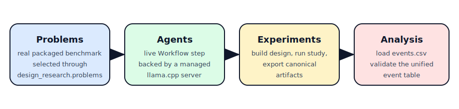

Prompt Strategy Comparison Walkthrough
======================================

This walkthrough demonstrates the umbrella package doing real work with a live
model-backed agent while following the comparison-study recipe/reporting APIs
landing on the April 2026 sibling-library branches. It uses a real packaged
problem from ``design_research.problems``, a managed
prompt-mode ``design_research.agents.Workflow``,
``design_research.agents.PromptWorkflowAgent``, the
``design_research.experiments.build_strategy_comparison_study`` scaffold, and
the newer condition-comparison helpers from ``design_research.analysis``.

What This Covers
----------------

- resolves a real packaged problem through ``design_research.problems``
- resolves that problem through the sibling-owned
  ``design_research.experiments.resolve_problem`` interop API so packaged
  evaluations normalize cleanly into experiment rows
- builds the study from
  ``design_research.experiments.build_strategy_comparison_study`` with a
  recipe-first benchmark bundle containing a random baseline, a neutral
  prompt, and a profit-focused prompt
- runs the live study through ``design_research.experiments.run_study``
- exports the canonical study artifacts plus a markdown summary report built
  from ``render_markdown_summary``, ``render_methods_scaffold``,
  ``render_codebook``, and ``render_significance_brief``
- validates the exported event rows through ``design_research.analysis``
- computes ordered one-sided condition-pair permutation tests from the exported
  ``runs.csv`` and ``evaluations.csv`` tables via
  ``build_condition_metric_table`` and ``compare_condition_pairs``

Branch Alignment
----------------

This local walkthrough intentionally tracks the April 2026 release-branch APIs
from ``design-research-agents``, ``design-research-experiments``, and
``design-research-analysis``. If you run it against older releases of those
sibling packages, it will fail fast with a clear upgrade message instead of
silently drifting from the new workflow/recipe/reporting surface.

During local development, the umbrella test harness can point subprocess runs
at adjacent sibling worktrees so the examples stay validated against the same
public APIs owned by the sibling libraries themselves.

Run It
------

.. code-block:: bash

   python -m pip install "llama-cpp-python[server]" huggingface-hub
   make run-example

Optionally point the walkthrough at a specific local GGUF file:

.. code-block:: bash

   export LLAMA_CPP_MODEL=/path/to/model.gguf
   make run-example

The default configuration uses eight replicates per condition. To push to a
larger sample size, raise the replicate count explicitly:

.. code-block:: bash

   export PROMPT_STUDY_REPLICATES=12
   make run-example

The example writes canonical exports to
``artifacts/examples/prompt_strategy_comparison_study`` and writes a markdown
summary report to
``artifacts/examples/prompt_strategy_comparison_study/artifacts/prompt_strategy_summary.md``.
It prints condition means, a condition-comparison brief, a significance brief,
the summary-report path, exported artifact paths, and the event-table
validation summary. The script intentionally has no deterministic fallback path
for the live-agent conditions: it expects a real ``llama.cpp`` runtime.

If ``LLAMA_CPP_MODEL`` is not set, the client falls back to its built-in model
defaults and Hugging Face repo settings. The first run may therefore download a
model before the walkthrough executes, which is why the setup above includes
``huggingface-hub``.

The script is intentionally written in a linear, step-by-step style so it can
double as training material and as the literal-included documentation example.
The only local callbacks left in place are the small workflow request/response
adapters and the condition-specific prompt builders passed into
``PromptWorkflowAgent(...)``.

Code
----

.. literalinclude:: ../examples/prompt_framing_study.py
   :language: python
   :linenos:
   :caption: ``examples/prompt_framing_study.py``

When To Go Direct
-----------------

Use the umbrella package when you want one stable import surface for the
ecosystem. Install a sibling package directly when you only need one layer or
want package-specific internals. See :doc:`compatibility` for the tested
version combination and install guidance.
